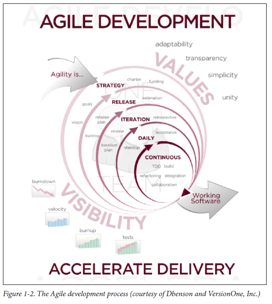
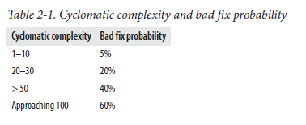

# Testable JavaScript by Mark Ethan Trostler

## 1. Testable JavaScript
## 2. Complexity
## 3. Event-Based Architectures
## 4. Unit Tests
## 5. Code Coverage
## 6. Integration, Performance, and Load Testing
## 7. Debugging
## 8. Automation

---
---

# 1. Testable JavaScript

## Introduction

Your ideas are unique; your code is not. Almost every industry has been completely revolutionized by machines; yet strangely, the computer science industry has not. Programmers are essentially doing the exact same things we have been doing for 40 years or so. We write code by hand, and that code gets compiled or interpreted and then executed. We look at the output and determine whether we need to go around again. This cycle of development has remained unchanged since the dawn of computer science. Our machines are orders of magnitude faster, RAM and secondary storage sizes are unimaginably large, and software has grown increasingly complex to take advantage of these developments. Yet we still write code by hand, one keystroke at a time. We still litter our code with “print” statements to figure out what is going on while it runs. Our development tools have indeed grown increasingly powerful, but with every hot new language, tooling starts all over again. The bottom line is that writing software remains an almost entirely manual process in a world of incredible automation, and most of that automation is due to the fruits of our software-writing labors. The very act of writing software one character at a time is the height of hypocrisy.

While the bulk of any code you write has been written before, either in the language you are currently using or in another one, every application is unique, even if yours is doing exactly the same thing as your competitor’s. Unique or not, to succeed the application must also work. It does not have to be beautiful. It does not have to be the absolute fastest, nor does it have to be the most feature-rich. But it does have to work.

Applications are, at their core, just message-passing systems with some input and output. The amount of complexity built on top of that standard idiom continues to increase. With the advent of JavaScript, we must apply the lessons learned not only from other languages, but also from JavaScript itself to make our code testable. As JavaScript applications grow in size, on both the client and the server, we must be extremely careful to apply the best practices and lessons learned by our forefathers and tweak them to fit well with JavaScript.

Figure 1-1 shows the microprocessor cost per transistor cycle over the course of three decades.1 This ridiculous graph of cost per cycle of CPUs, following Moore’s law, keeps trending inexorably downward. Hardware refresh rate is indeed progressing far beyond anything seen in the software side of the world.


Enormous benefits have been achieved by programming machines to stamp out objects faster and smaller than ever before. In order to reach the incredible scale of global production, these rows of machines, assembled into factories, rely on standardization. Yet software engineers still sit in front of their individual computers, pecking away on their keyboards one character at a time.

## Prior Art

While writing software is still an extremely manual process, there have been a lot of attempts to codify and standardize what developers should do to create a more repeatable process for writing “good” code. These processes, of course, hope to steer the wayward developer into writing “clean” and “bug-free” code. However, as with most things in life, “you gotta wanna”—and the results of employing any of the processes or methodologies covered in the following sections depend directly on the willingness of the developers to “buy in” to the system. The meat of this book is not about how or which methodology to use or choose, but what to do and think about when actually programming. Let’s run through some of the current thinking.

## Agile Development

This is a big one that is a placeholder for a lot of practices. The Agile approach is mainly a response to the “waterfall” model of software application development that occurs using a serialized process of discrete stages. For example, first the specification is written, then coders code, then testers test, then the application is deployed, and then we go back to updating the specification for new features. Each step in the process happens serially and in isolation. So, while the specification is written, the coders and testers wait. While the coders code, the testers wait, while the testers test, everyone waits, and so on.

Agile development tries to be more flexible and allow each stage to occur in parallel. Software that works is the top priority. Instead of waiting around for large chunks of time for the previous step to be perfect before handoff, each team iterates over shorter cycles, so things are always happening. Big chunks of work get broken down into smaller chunks that can be more easily estimated. Agile seeks to break down the walls between each group in the development cycle so that they work together and therefore reduce the time between deliverables. Collaboration with customers helps to define the final deliverable.

Note that the use of Agile methods does not necessarily mean your application is completed faster or with higher quality. Agile’s biggest strength is the way it deals with changes. In the waterfall model, any change would require running through the entire process all over again. Agile’s shorter cycles allow changes to be more easily incorporated into the final product. You might be using Agile already if you hear the words fail fast, release often, backlog, standup, or any phrase with the word continuous. Most modern development utilizes Agile to some extent. Figure 1-2 shows the canonical chart of the Agile development process.

There is a lot going on in Figure 1-2, but the basic idea is that quick iteration and constant interaction will accelerate the delivery of quality software.

Agile itself does not mandate how software is written; rather, it recommends several methodologies that fit well with the Agile philosophy. For example, “user stories” are plain sentences by “users” about what features they need from the application. These stories are ideally fed back into the product as feature requests for the application. A user is anyone who uses your application or API, from someone sitting at home to a developer in another group who can contribute to help define the feature set of the final application. Pair programming is another development methodology often associated with Agile. In its purest form, pair programming is two programmers sitting at the same desk, staring at the same monitor, with one keyboard and mouse, writing software together. While one programmer is typing, the other is actively debugging and thinking about the code. Two minds are typically better than one, so issues are found and resolved more quickly than if the two programmers were working in isolation.



## Test-Driven Development

Test-driven development (TDD) is a recommended practice of Agile software development. TDD wants you to write your tests first, before you write any code. These tests provide the expectations to which your code must conform. After you write tests that fail (as there initially is no code to make the tests work), you then start writing code that makes your tests pass. As your tests stay one step ahead of your development, you will never have any code that is not covered by a test. That is the theory, at least. In reality, what tends to happen is developers start to go down this path and initial tests are written, but the code soon overtakes the tests. Hey, at least you got some tests out of the bargain!

TDD clearly works best when you are starting a new project or module. It is also most successful if only unit tests are required. Writing full integration tests before any code exists is daunting! TDD also provides a great reason/excuse to rewrite existing legacy code. If a developer’s choice is “write a bunch of tests for already existing code” or “write your own new code starting with tests,” most likely the developer will choose the latter option. Of course, developers do not always have a choice; just do not expect happy faces and high fives from them if writing tests for an already existing codebase is the path chosen to move forward.

Regardless, TDD is not a bad thing; in fact, it can be a very good thing. TDD is great at beginnings, whether an entire application or a single module—everyone is excited to write new code, and if the “cost” of writing that new code is writing tests first, so be it. And as there is no code at the beginning, the “cost” of writing tests is minimal.

An interesting study in 2005 on Canadian undergraduates found that TDD made programmers more productive because they wrote more tests. While that is debatable, what is more interesting is that the researchers “also observed that the minimum quality increased linearly with the number of programmer tests, independent of the development strategy employed.”2 It is good to know that the number of tests is proportional to higher code quality. The conclusion one could draw is that any methodology that gets developers to write more tests before, during, or after coding is a very good thing.

## Behavior-Driven Development

Behavior-driven development (BDD) builds on TDD to provide developers and nondevelopers a common language to describe correct application and module behavior. The common language is just your everyday language. For example, instead of writing a test called testEmptyCart, you would provide a description that defines the behavior of the module under test, such as “the shopping cart should not allow you to check out if it is empty.” Using a common language to define tests or expectations allows anyone to more easily understand what is being tested, as well as helping to define what the tests and expectations should be.

BDD utilizes Agile user stories to define tests against the code. The user stories can then be directly translated into tests. The user stories typically must follow a specific template of the form: As a [someone] I want to [something] so that [result].

Each blank is filled in appropriately, as in a Yahoo! Mail user I want to attach a picture to my email so that my recipients can see it. This user story can then be translated into a set of feature requirements and tests for the Yahoo! Mail product.

BDD is great for formalized feedback from people not on your team (technical or not), to help you understand how your system should operate. The user stories can usually be directly translated into tests—and anything that promotes focused testing (and more of it) is a very good thing!

## The Best Approach?

This book is intended to neither advocate nor explicate any development methodology, and by that measure I think it succeeds admirably. Waterfall, spiral, Agile, and other methodologies are all well and good, but none necessarily leads to testable code, let alone testable JavaScript. Similarly, TDD, BDD, and other forms of development also do not necessarily lead to testable JavaScript. What does lead to testable JavaScript? A commitment to writing clear, loosely coupled, and well-commented code that you know will be maintained by someone else will lead to testable JavaScript. Writing, reading, and maintaining testable JavaScript does not require test-driven, behavior-driven, or any other “-driven” development practices. However, following any practice that emphasizes tests along with code is a good thing. The most important thing to internalize is that the code you write does not exist in a vacuum. Any code you write professionally will be looked at, compiled, debugged, and finally used by not only yourself, but hopefully someone else too. In the end, you are writing code for other people to maintain, study, and use.

## Code Is for People

This has been beaten into our heads a lot lately, and I am not going to let up on that trend! The code we write is not for computers, it is for people. Writing software is a hands-on business. Computers just want the bits; JavaScript, C++, Java, Perl, Lisp, or whatever else all gets compiled down to the CPU’s extremely limited instruction set. The CPU does not know if it is running a “compiled” or “interpreted” language. The CPU does not care about comments or semicolons or whitespace. The CPU is blissfully unaware of the structure, syntax, or semantics of any of the myriad computer programming languages people use. A JavaScript program looks just like a C++ program, which looks exactly like a Perl program to the CPU.

At the lowest level, the success or failure of our programs is intertwined with the machine language code that the CPU executes; but we rarely, if ever, see that. We see only the original code. The CPU does not care what you are trying to do, but people do.

Software starts with intent. What are you trying to do? What is this piece of code trying to accomplish? Why are you writing it? These are important questions that either you or your coworkers must ask every day. You transform that initial intent (the “whats” and the “whys”) into actual code: the “hows.” This book is mostly concerned with the “hows.” Figuring out what you are trying to do and why you are trying to do it are the necessary first steps toward getting to the “how” part of your job, but the rubber really hits the road when you are actually dealing with the “hows.” Books on programming languages help with the lowest-level “how”; then software-pattern books go one layer higher. This book hopes to clearly explain the top layer of the “how” totem pole: “how” to write testable code and “how” to test it.

But before we can get to the “how,” it is important to understand the “what” and the “why” of software development.

Why do we want to write testable code? What is testable code?

## Why

“Writing software is the hardest thing people do,” says Douglas Crockford, which means it is extremely important that software be as human-friendly as possible. Testable code is easier to test, which means it is easier to maintain, which means it is easier for people (yourself included) to understand it, which makes it easier to maintain, which in turn makes it easier to test.

We have gone in a circle, but it is a virtuous circle. There is no Platonic ideal of perfect code; testability, maintainability, and understandability are interlocked, and there are lots of opinions about what these things are and how to get there with software. However, finding and fixing bugs is much simpler with testable, maintainable, and understandable code. And you as a programmer will spend at least half of your time finding and fixing bugs, either in your code or in someone else’s, so be nice to yourself and try to make that time as pleasant as possible.

## Why testable

Testing code, using any kind of testing, is a required activity. Either you test it or someone else does, even if it is the end user simply using your application. Nothing is perfect the first time, or any subsequent time thereafter. Even one of the simplest JavaScript programs:

```x = x + 1;```

can have problems. What if x is a string? What if x is infinity? What if x is an object? As our programs get more complicated, we can only hope to test the most common paths for sanity. Exhaustive testing is impossible. Writing code that is easy to test, or “testable,” at least gives testers a fighting chance to accomplish the most basic and hopefully evermore advanced testing.

## Why maintainable

Programmers do not always write code from scratch. Sometimes we are tasked with debugging and maintaining someone else’s code. That someone else may be long gone, just as you are long gone from the code you wrote at your previous company. While you are maintaining someone else’s code, someone else is maintaining yours. Besides making the world a better place, code that is testable is also more “maintainable.” Usually you do not have a full picture of what your changes will affect, and having tests, made possible by testable code, can help you figure out the extent and ramifications of your seemingly little changes. When you know how the code works—specifically, what will happen when you make changes to it—you have maintainable code. This is code you are not afraid of. This is code that you can more easily share with members of your team. This is code that does not need to be rewritten solely to understand it. As an application increases in size, the number of people with full knowledge of the code dwindles rapidly. Even these people can be surprised that a seemingly innocuous change has affected functionality elsewhere.

## Why understandable

The third feature of quality software, which is intertwined with the other two, is the ability to look at code and understand it. How long does it take when staring at a piece of code to understand what it does? Clearly, being able to test it (and have tests for it) goes a long way toward helping you understand what the code is doing. But can you look at a method or function and understand not only the author’s intent but also the “how”? If you cannot understand either code you wrote six months ago or code someone else wrote, you have a serious problem. Looking at a piece of code and understanding it is not only satisfying, but also necessary to properly fulfill your job requirements. Conversely, if you have written code that you no longer understand, you have failed. Code is for people to understand, maintain, and test. You write code for other people, which means your peers must be able to relatively quickly understand your code. If cod is not understood, it can be neither tested nor maintained. In those circumstances, code typically gets completely rewritten. You may be throwing out crap or you may be throwing out awesome code that is 99% bug-free, but how could anyone ever know that? If it is not testable, maintainable, and understandable, it is trash.

## What

So “what” exactly is “testable” code? What does “maintainable” code look like? What kind of code is “understandable” code? Let us dig a bit deeper into those questions. We will see numerous examples of “what” all of this looks like throughout this book.

### What is testable

Testable code is code that is easy to test. Bet you didn’t see that coming! But what makes code easy to test? In general, the features that make code easy to test are the same ones that make it easy to maintain, and more understandable: there’s less of it, and it’s less complex code, fully commented, and loosely coupled. These features and more make code “testable.” By exploiting testability features and using tools focused on testing, you make your code more and more testable.

### What is maintainable

Maintainable code is code that can be handed over to other team members and peers with a minimum of handholding and transition. Code that is testable with good tests and is understandable is more maintainable than complex, uncommented code without tests. Maintainable code can live a full product life cycle: it does not need to be rewritten, either partially or fully, when passed off from person to person. Code that you can fix and change, without having to fully understand everything the code does but with the confidence that your changes have not broken something else, is maintainable code.

### What is understandable

How long will it take when looking at a piece of code—either a function or an even smaller piece—for you to understand it? Does the original author need to explain it to you step by step? Or can you “get” it yourself in a reasonable amount of time? Simple, small, and commented code tends to be more understandable. Being able to test your assumptions about the code by running it in isolation also helps greatly in terms of understanding. It is vitally important that code is understandable; otherwise, it will be thrown away and rewritten.

## How

Understanding the “why” and the “what” leads us to the “how.” This book is primarily concerned with how you can write, test, and maintain testable, maintainable, and understandable code. Clearly, testing and maintaining code that is already testable, maintainable, and understandable will make your job easier. Starting with this solid foundation will make you much more productive, and productive people are happy people, and happy people are productive people! It’s one of those virtuous circles again. I like virtuous circles.

### How testable

Writing testable code is easier when you start with a blank slate (isn’t everything easier when you start with a blank slate?). Some development methodologies, such as TDD and BDD, can lead to testable code, but not necessarily. This is because having tests for code does not automatically make that code testable. However, when you think about testing from the start, your code typically will end up more testable than code written from scratch without regard to testing. I do not demand that you use TDD or BDD when writing code; however, I think it is a great idea to start with testing in mind, and I believe that testing constantly is necessary to writing testable code. Writing tests or the UI first is not a requirement for testable code, but writing unit tests first (TDD) or integration tests first (BDD) speaks to a fundamental notion of testable code: the sooner the code can be executed and tested, the better. I would like to squeeze a third approach in between TDD and BDD: test-while-driven development (TWDD). The tests and the code are in a chicken-and-egg situation: either one can come first, as long as the other comes immediately afterward—meaning, do not write a lot of tests and no code, and do not write a lot of code and no tests. Instead, write a little code and then quickly write a little test. Or perhaps write a little test and then write a little code.

Again, this does not necessarily lead to testable code. You can still write crap with a lot of tests. While you are writing little bits of code and little tests, remember the bigger picture: write small, isolatable chunks of code with minimal dependencies and minimal complexity. That mindset is the essence of this book.

### How maintainable

You can achieve maintainable code in much the same way you achieve testable code: by writing small bits of simple, isolatable code—small because the fewer the lines of code, the fewer the bugs; simple because simple code is easier to maintain; and isolatable so that changes made to the code will affect as few other pieces of the code as possible. We will investigate several methods for keeping your code small and isolated throughout this book.

### How understandable

Not surprisingly, writing understandable code follows the same principles. Simple code is more quickly understood. Having tests along with the code gives further insight into the intent and inner workings of the code. Comments greatly aid in understandability. Writing code is similar to composing chapters in a novel: several small chapters are easier to understand than a few large ones. Being verbose in both comments (inserting comment blocks before methods) and code (choosing meaningful variable names, following best practices, following a consistent coding style, etc.) enhances understandability. Your peers tasked with maintaining your code are not morons. Give them some signposts to aid in their understanding, and your code will not have to be thrown away and rewritten.

## Beyond Application Code

Your job does not end with writing small chunks of testable code. You also get to test it! Writing testable code makes testing it, and finding bugs within it, much easier. No developer wants to attempt to debug a giant mound of code, especially if said developer did not write it.

### Testing

Unit tests are a developer’s first line of defense. Not only do unit tests force you, the developer, to understand your code, but they also help you to document and debug your code. Beyond unit testing, integration testing helps to ensure that everything is working together as planned—especially client-side JavaScript, which runs on many different browsers on an increasing number of platforms (desktops, tablets, and phones). Finally, performance testing and load testing help to ensure that your application is performing to specification. Each step up the testing ladder exercises your code at different levels of abstraction. Each test type finds bugs in different usage scenarios. Fully testing code requires tests at all levels of abstraction. And still you will have bugs in production; there is no magic bullet.

### Debugging

Regardless of the number of tests you conduct, debugging is a fact of life for software developers. Fortunately, JavaScript has some very nice tools that are constantly improving to help. Leveraging these tools will help make your debugging life easier, which is nice, as you will probably spend much more time debugging your code than writing it.

Whether you are debugging locally or remotely, many powerful tools are available for step-by-step debugging and resource management.

# 2. Complexity

## Introduction

Complex: bad. Simple: good. We touched on this already, and it’s still true. We can measure complexity with some accuracy via static analysis. Measures such as JSLint, cyclomatic complexity, lines of code, and fan-in and fan-out are important. However, nothing measures complexity as accurately as showing your code to a coworker or colleague.

Code can be complex for a number of reasons, from the serious “this is a hairy algorithm” to the mundane “a JavaScript newbie wrote it and it’s nasty,” and everything in between. Analyzing the complexity of static code is a great starting point toward creating testable JavaScript.

Maintainable JavaScript is clear, consistent, and standards-based. Testable JavaScript is loosely coupled, short, and isolatable. The magic happens when your code is both maintainable and testable. Since you will spend about 50% of your time testing and debugging your code, which is significantly more time than you will spend coding it, you might as well make code maintenance as easy on yourself and others as possible.

Complexity is the bane of every software project. While some complexity is unavoidable, in many cases complexity can be avoided. Being able to recognize which parts of your application are complex, and understanding why, will allow you to reduce its overall complexity. As always, recognizing the problem is the first step toward fixing it.

It is also important to note that the algorithms your code relies on may be complex as well. In fact, typically these complex algorithms are what make your code unique and useful. If your core algorithms were not complex, someone probably would have already created your application. However, unavoidable (in fact, beneficial) algorithm complexity is no excuse for writing complicated code. Although the details, and perhaps the code, surrounding your algorithm may be complex, of course there is a lot more to your application than some core algorithms.

## Code Size

As code size grows, code complexity increases and the number of people who understand the entire system shrinks. As the number of modules increases, integration testing becomes increasingly difficult and the number of module interaction permutations grows. It is not surprising, therefore, that the number-one indicator of bugs/bug potential is code size. The more code you have, the greater the chance it will have bugs in it. The total amount of code necessary for your project may not change, but the number of statements in a method can. The amount of code in each file is also changeable. Large methods are difficult to test and maintain, so make more small ones. In an ideal world, functions have no side effects and their return value(s) (if any) are completely dependent on their parameters. Code rarely gets to live in that world, but it is something to keep in mind while writing code, along with “how am I going to test this thing?”

One method that can keep functions minimally sized is command query separation. Commands are functions that do something; queries are functions that return something. In this world, commands are setters and queries are getters. Commands are tested using mocks and queries are tested using stubs (more on this in Chapter 4). Keeping these worlds separate, along with enhancing testability, can provide great scalability returns by ensuring that reads are separated from writes.

## Cyclomatic Complexity

Cyclomatic complexity is a measure of the number of independent paths through your code. Put another way, it is the minimum number of unit tests you will need to write to exercise all of your code. Let’s look at an example:

```JavaScript
function sum(a, b) {
    if (typeof(a) !== typeof(b)) {
        throw new Error("Cannot sum different types!");
    } else {
        return a + b;
    }
}
```

This method has a cyclomatic complexity of 2. This means you will need to write two unit tests to test each branch and get 100% code coverage.

Generating the cyclomatic complexity of your code is simple using a command-line tool such as jsmeter. However, determining what is optimal in terms of cyclomatic complexity is not so simple. For instance, in his paper “A Complexity Measure”, Thomas J. McCabe postulated that no method should have a cyclomatic complexity value greater than 10. Meanwhile, a study that you can read about states that cyclomatic complexity and bug probability will not correlate until cyclomatic complexity reaches a value of 25 or more. So why try to keep the cyclomatic complexity value less than 10? Ten is not a magic number, but rather a reasonable one, so while the correlation between code and bugs may not begin until cyclomatic complexity reaches 25, for general sanity and maintainability purposes keeping this number lower is a good idea. To be clear, code with a cyclomatic complexity value of 25 is very complex. Regardless of the number of bugs in that code currently, editing a method with that much complexity is almost assured to cause a bug. Table 2-1 shows how Aivosto.com measures “bad fix” probabilities as cyclomatic complexity increases.



An interesting tidbit is apparent from this table: when fixing relatively simple code there is a 5% chance you will introduce a new bug. That is significant! The “bad fix” probability increases fourfold as cyclomatic complexity gets above 20. I have never seen a function with cyclomatic complexity reaching 50, let alone 100. If you see cyclomatic complexity approaching either of those numbers, you should scream and run for the hills.

Also, the number of unit tests necessary to test such a beast is prohibitive. As McCabe notes in the aforementioned paper, functions with complexities greater than 16 were also the least reliable.

Reading someone else’s code is the most reliable indicator of code quality and correctness (more on that later). The reader must keep track of what all the branches are doing while going over the code. Now, many scientists have conducted studies on short-term memory; the most famous of these postulates that humans have a working memory of “7 plus or minus 2” items (a.k.a. Miller’s Law),2 although more recent research suggests the number is lower. However, for a professional programmer reading code, that cyclomatic complexity value can be higher for shorter periods of time, but it doesn’t have to be. Exactly what battle are you fighting to keep your code more complex? Keep it simple!

Large cyclomatic complexity values are usually due to a lot of if/then/else statements (or switch statements, but you are not using those as they are not one of the “good parts,” right?). The simplest refactoring fix, then, is to break the method into smaller methods or to use a lookup table. Here is an example of the former:

```JavaScript
function doSomething(a) {
    if (a === 'x') {
        doX();
    } else if (a === 'y') {
        doY();
    } else {
        doZ();
    }
}
```

## Reuse

The best way to reduce code size is to decrease the amount of code you write. The theory is that using third-party (either external or internal) code that is production-ready and maintained by someone else takes a good chunk of responsibility away from you. Almost everyone uses third-party code, open source or not, in their programs. Jeffrey Poulin, while at Loral Federal Systems, estimated that up to 85% of code in a program is not application-specific; only 15% of the code in a program makes it unique. In his 1995 paper “Domain Analysis and Engineering: How Domain-Specific Frameworks Increase Software Reuse”, he says the following:

> A typical application will consist of up to 20% general-purpose domain-independent software and up to another 65% of domain-dependent reusable software built specifically for that application domain. The remainder of the application will consist of custom software written exclusively for the application and having relatively little utility elsewhere.

He illustrates the three classes of software—application-specific, domain-specific, and domain-independent—as shown in Figure 2-1.


## Fan-Out

Fan-out is a measure of the number of modules or objects your function directly or indirectly depends on. Fan-out (and fan-in) were first studied in 1981 by Sallie Henry and Dennis Kafura, who wrote about them in “Software Structure Metrics Based on Information Flow,” published in IEEE Transactions on Software Engineering. They postulated that 50% to 75% of the cost of software is due to maintenance, and they wanted to measure, as early as the design phase as possible, the complexity of software to be written. Building on previous work that demonstrated that greater complexity led to lower-quality software, they figured that if complexity could be measured and controlled while (or even before) the software was being built, everyone would win. They were familiar with McCabe’s work on measuring cyclomatic complexity and its relationship to software quality (published in 1976 and referenced earlier in this chapter) and other lexical analysis techniques, but they were convinced that they could get a better complexity measurement by measuring the underlying structure of the code instead of just counting tokens.

So, using information theory and analyzing flows between functions and modules, they cooked up a formula for a complexity measurement:

```(fan_in * fan_out)^2```

They then calculated this value (and some variants) using the Unix OS and found a 98% correlation between it and “software changes” (i.e., bug fixes). To wit: the more complex a function or module measured by their formula, the more likely there were to be bugs in that function or module.

So, what the heck are fan-in and fan-out? Here is their definition of fan-out:

> The fan-out of procedure A is the number of local flows from procedure A plus the number of data structures which procedure A updates.

In this definition, a local flow for A is counted as (using other methods B and C):

1. if A calls B
2. if B calls A and A returns a value to B, which B subsequently utilizes
3. if C calls both A and B, passing an output value from A to B

So, adding all of those flows for function A, plus the number of global structures (external to A) that A updates, produces the fan-out for function A. Fan-in is defined similarly, as we will see shortly.

Calculating this value and the corresponding value for fan-in for all of your functions, multiplying those two numbers together, and squaring the result will give you another number that measures the complexity of a function.

Using this measure, Henry and Kafura note three problems inherent in highly complex code. First, high fan-in and fan-out numbers may indicate a function that is trying to do too much and should be broken up. Second, high fan-in and fan-out numbers can identify “stress points” in the system; maintaining these functions will be difficult as they touch many other parts of the system. And third, they cite inadequate refinement, which means the function needs to be refactored, because it is too big and is trying to do too much, or there is a missing layer of abstraction that is causing this function to have high fan-in and fan-out.

Building on function complexity measures, Henry and Kafura note that one can generate module complexity values, and from there one can measure the coupling between the modules themselves. Applying the lessons from the function level, one can determine which modules have high complexity and should be refactored or perhaps demonstrate that another layer of abstraction is necessary. They also found that typically the vast majority of a module’s complexity is due to a small number of functions (three!), regardless of the module’s size. So beware of the one “mongo” function that does way too much, while most of the other functions do very little!

Henry and Kafura also looked at function length (using lines of code) and found that only 28% of functions containing fewer than 20 lines of code had an error, whereas 78% of functions with more than 20 lines of code had errors. Keep it short and small, people!

Intuitively, it makes sense that functions with large fan-out are more problematic. Java‐ Script makes it very easy to declare and use global variables, but standards-based Java‐ Script tells us to not use the global space and instead to namespace everything locally. This helps to reduce fan-out by taking away part of the fan-out definition (“the number of data structures A updates”), but we still must account for our functions’ local flows.

You can inspect this easily by seeing how many foreign objects your function requires. The following example uses YUI’s asynchronous require mechanism to pull in the my Module chunk of JavaScript code. A detailed discussion of this is available here; the main point to understand here is that we are telling YUI about a dependency of our code, which YUI will fetch for us. It will then execute our callback when the dependency has been loaded:

```JavaScript
YUI.use('myModule', function(Y) {
    var myModule = function() {
        this.a = new Y.A();
        this.b = new Y.B();
        this.c = new Y.C();
        };
    Y.MyModule = myModule;
}, { requires: [ 'a', 'b', 'c' ] });
```

The fan-out for the myModule constructor is 3 (in this case, the objects are not even being used; they are just being created and stored for future methods, but they are still required here, so they count against the constructor’s fan-out). And this is without the constructor being instantiated and used yet. Three is not a bad number, but again that number will grow when an outside object instantiates myModule and uses any return value from any local myModule method it calls. Fan-out is a measure of what you need to keep track of in your head as you edit this method. It is a count of the external methods and objects this method manipulates.

Regardless of whether we are counting local flows, Miller’s Law argues that trying to remember and track more than seven things is increasingly difficult. Later reanalysis has brought that number down to four.3 The point is that there is no specific number that is a danger indicator, but when fan-out is greater than 7 (or even 4) it is time to look at what is going on and possibly refactor. Excessive fan-out belies other issues, namely tight coupling, which we will also investigate in this chapter.

High fan-out can be problematic for even more reasons: the code is more complex, making it harder to understand and therefore test; each direct dependent must be mocked or stubbed out during testing, creating testing complexity; and fan-out is indicative of tight coupling, which makes functions and modules overly brittle.

A strategy to tame fan-out without eventing involves creating an object that encapsulates some of the fanned-out modules, leaving the original function with the single dependency on that new module. This obviously makes more sense as the fan-out of the original function increases, especially if the newly factored-out module can be reused by other functions as well.

## Fan-In

Most of what we discussed about fan-out also applies to fan-in, but not everything. It turns out that a large fan-in can be a very good thing. Think about common elements of an application: logging, utility routines, authentication and authorization checks, and so on. It is good for those functions to be called by all the other modules in the application. You do not want to have multiple logging functions being called by various pieces of code—they should all be calling the same logging function. That is code reuse, and it is a very good thing.

Fan-in can be a good measure of the reuse of common functions in code, and the more the merrier. In fact, if a common function has very low fan-in, you should ensure that there is no duplicated code somewhere else, which hinders code reuse.

In some cases, though, high fan-in is a bad thing. Uncommon and nonutility functions should have low fan-in. High(er) levels of code abstraction should also have low fan-in (ideally, a fan-in of 0 or 1). These high-level pieces of code are not meant to be used by lots of other pieces of code; typically they are meant to be used by just one other piece, usually to get them started once and that is it.

Here is the “official” fan-in definition:

> The fan-in of procedure A is the number of local flows into procedure A plus the number of data structures from which procedure A retrieves information.

You get the idea: watch out for a piece of code that has large fan-in and large fan-out, as this is not desirable due to the high complexity and high amount of coupling that result.

Fan-in helps you identify code reuse (or not). Code reuse is good; scattered logging and debugging functions across your code are bad. Learn to centralize shared functions (and modules) and use them!

## Coupling

While fan-out counts the number of dependent modules and objects required for a module or function, coupling is concerned with how those modules are put together. Submodules may reduce the absolute fan-out count, but they do not reduce the amount of coupling between the original module and the original dependent. The original module still requires the dependent; it is just being delivered via indirection instead of explicitly.

Some metrics try to capture coupling in a single number. These metrics are based on the six levels of coupling defined by Norman Fenton and Shari Lawrence Pfleeger in Software Metrics: A Rigorous & Practical Approach, 2nd Edition (Course Technology) way back in 1996. Each level is given a score—the higher the score, the tighter the coupling. We will discuss the six levels (from tightest to loosest) in the following subsections.

### Content Coupling

Content coupling, the tightest form of coupling, involves actually calling methods or functions on the external object or directly changing its state by editing a property of the external object. Any one of the following examples is a type of content coupling with the external object O:

```JavaScript
O.property = 'blah'; // Changing O's state directly

// Changing O's internals
O.method = function() { /* something else */ };

// Changing all Os!
O.prototype.method = function() { /* switcheroo */ };
```

### Common Coupling

Slightly lower on the coupling spectrum is common coupling. Your object is commonly coupled to another object if both objects share a global variable:

```JavaScript
var Global = 'global';
Function A() { Global = 'A'; };
Function B() { Global = 'B'; };
```

### Control Coupling

Next up is control coupling, a slightly looser form of coupling than common coupling. This type of coupling controls how the external object acts based on a flag or parameter setting. For example, creating a singleton abstract factory at the beginning of your code and passing in an env flag telling it how to act is a form of control coupling:

```JavaScript
var absFactory = new AbstractFactory({ env: 'TEST' });
```

### Stamp Coupling

Stamp coupling is passing a record to an external object that only uses part of the record, like so:

```JavaScript
// This object is stamp coupled to O
O.makeBread( { type: wheat, size: 99, name: 'foo' } );

// Elsewhere within the definition of O:
O.prototype.makeBread = function(args) {
    return new Bread(args.type, args.size);
}
```

### Data Coupling

The loosest coupling of them all is data coupling. This type of coupling occurs when objects pass messages to one another, with no transfer of control to the external object. We will investigate this much further in Chapter 3. Data coupling scores a measly 1.

### No Coupling

The last form of coupling (and my personal favorite), with absolutely zero coupling whatsoever between two objects, is the famed “no coupling.” No coupling scores a perfect 0.

## Instantiation

While not formally a part of the coupling jargon, the act of instantiating a nonsingleton global object is also a very tight form of coupling, closer to content coupling than common coupling. Using new or Object.create creates a one-way, tightly coupled relationship between the objects. What the creator does with that object determines whether the relationship goes both ways.

Instantiating an object makes your code responsible for that object’s life cycle. Specifically, it has just been created by your code, and your code must now also be responsible for destroying it. While it may fall out of scope when the enclosing function ends or closes, any resources and dependencies the object requires can still be using memory— or even be executing. Instantiating an object foists responsibilities on the creator of which you must be aware. Certainly, the fewer objects your code instantiates, the clearer your conscience will be. Minimizing object instantiations minimizes code complexity; this is a nice target to aim for. If you find that you are creating a lot of objects, it is time to step back and rethink your architecture.

## Coupling Metrics

The point of naming and scoring each type of coupling, besides giving us all a common frame of reference, is to generate metrics based on coupling found in functions, objects, and modules. An early metric calculates the coupling between two modules or objects by simply adding up the number of interconnections between the modules or objects and throwing in the maximum coupling score.4 Other metrics try to measure the coupling inherent in a single module.5 A matrix has also been created between all modules in an application to view the overall coupling between each of them.

The point here is that a number or set of numbers can be derived to determine how tightly or loosely coupled a system or set of modules is. This implies that someone “above” the system is trying to determine its state. For our purposes, we are the programmers looking at this stuff every day. Once we know what to look for, we can find it and refactor if necessary. Again, code inspections and code reviews are an excellent way to find code coupling, instead of relying on a tool to root out coupling metrics.

## Coupling in the real world

Let’s look at some examples of coupling in JavaScript. The best way to understand loose coupling is to take a look at tight coupling:

```JavaScript
function setTable() {
    const cloth = new TableCloth()
    const dishes = new Dishes();
    this.placeTableCloth(cloth);
    this.placeDishes(dishes);
}
```

This helper method, presumably belonging to a Table class, is trying to set the table nicely. However, this method is tightly coupled to both the TableCloth and Dishes objects. Creating new objects within methods creates a tight coupling.

This method is not isolatable due to the tight coupling—when I’m ready to test it I also need the TableCloth and Dishes objects. Unit tests really want to test the setTable method in isolation from external dependencies, but this code makes that difficult.

As we saw in the cooking example earlier, globally mocking out the TableCloth and Dishes objects is painful. This makes testing more difficult, although it is certainly possible given JavaScript’s dynamic nature. Mocks and/or stubs can be dynamically injected to handle this, as we will see later. However, maintenance-wise this situation is less than ideal.

We can borrow some ideas from our statically typed language friends and use injection to loosen the coupling, like so:

```JavaScript
function setTable(cloth, dishes) {
    this.placeTableCloth(cloth);
    this.placeDishes(dishes);
}
```

Now testing becomes much simpler, as our test code can just pass in mocks or stubs directly to the method. Our method is now much easier to isolate, and therefore much easier to test.

## Testing Coupled Code

It is interesting to note the type and amount of testing required to test the various levels of coupled code. Not too surprisingly, the more tightly coupled the code is, the more resources are required to test it. Let’s go through the levels.

Content-coupled code is difficult to test because unit testing wants to test code in isolation, but by definition content-coupled code is tightly coupled with at least one other object external to it. You need the entire set of unit-testing tricks here to try to test this code; typically you must use both mocked objects and stubs to replicate the environment within which this code expects to run. Due to the tight coupling, integration testing is also necessary to ensure that the objects work together correctly.

Commonly coupled code is easier to unit-test as the shared global variable can be easily mocked or stubbed out and examined to ensure that the object under test is reading, writing, and responding to that variable correctly.

Control-coupled code requires mocking out the controlled external object and verifying it is controlled correctly, which is easy enough to accomplish using a mock object.

Stamp-coupled code is easily unit-tested by mocking out the external object and verifying the passed parameter was correct.

Data-coupled code and noncoupled code are very easily tested through unit testing. Very little or nothing needs to be mocked or stubbed out, and the method can be tested directly.

***Minimize coupling, and your testing will be easier.***

### Dependency Injection

We touched on injection only briefly earlier, so let’s take a closer look at it now. Dependencies make code complex. They make building more difficult, testing more difficult, and debugging more difficult; pretty much everything you would like to be simpler, dependencies make harder. Managing your code’s dependencies becomes an increasingly larger time sink as your application grows.

Injection and mocking are loosely related. Injection deals with constructing and injecting objects into your code, and mocking is replacing objects or method calls with canned dummy versions for testing. You could (and should!) use an injector to insert mocked versions of objects into your code for testing. But you should not use a mocking framework in production code!

Factoring out dependencies or manually injecting them into constructors or method calls helps to reduce code complexity, but it also adds some overhead: if an object’s dependencies are to be injected, another object is now responsible for correctly constructing that object. Haven’t we just pushed the problem back another layer? Yes, we have! The buck must stop somewhere, and that place is typically at the beginning of your application or test. Maps of object construction are dynamically defined up front, and this allows any object to be easily swapped out for another. Whether for testing or for upgrading an object, this is a very nice property to have.

A dependency injector can construct and inject fully formed objects into our code for us. Of course, an injector must be told how to actually construct these objects, and later, when you actually want an instance of that object, the injector will hand you one. There is no “magic” (well, perhaps a little); the injector can only construct objects you specify. Injectors get fancy by providing lots of different ways to describe exactly how your objects are constructed, but do not get lost in the weeds: you tell the injector how to construct an object (or have the injector pass control to your code to construct an object).

There is one more bit that injectors handle along with object construction: scope. Scope informs the injector whether to create a new instance or reuse an existing one. You tell the injector what scope each object should have, and when your code asks for an object of that type the injector will do the right thing (either create a new instance or reuse an existing one).